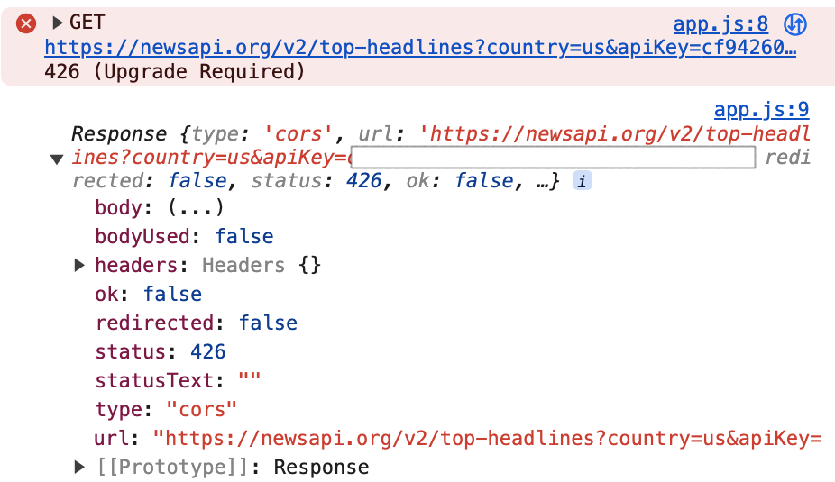
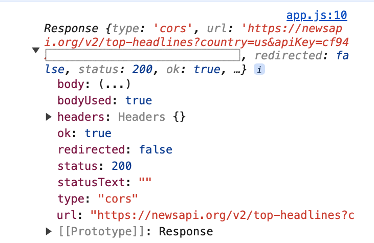

### News site

- 우리나라 최신 주요 뉴스 및 속보를 한 눈에 볼 수 있습니다.

### 미리보기

- https://gorgeous-hamster-de6bab.netlify.app

### 구현기능

- News API 호출
- 페이지네이션
- 라이트모드, 다크모드 UI
- 반응형 웹

### 이슈 해결

#### 1. API 호출하는 과정에서 status 426 발생

- News API Develoer Plan인 경우 localhost에서만 가능해서 생긴 이슈
- 나의 Live server 주소는 IPv4 주소로 사용되게 설정되어 있었음
- VSCode 설정에서 Use local IP 체크 해제 후 다시 실행하니 정상적으로 status 200으로 API 통신 가능하게 되었음

    
  
